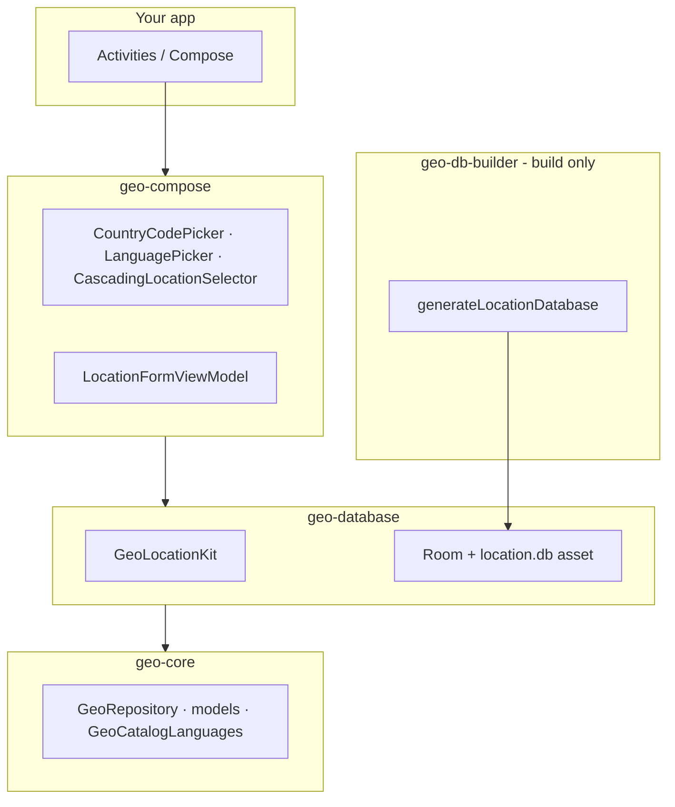

# Geo Location Kit

[](https://search.maven.org/search?q=g:io.github.etanaalemu)
[](https://github.com/EtanaAlemu/geo-location-kit/releases/latest)
[](https://jitpack.io/#EtanaAlemu/geo-location-kit)

**Site:** [etanaalemu.github.io/geo-location-kit](https://etanaalemu.github.io/geo-location-kit/) · **Latest:** `1.0.2`

Android library for **countries**, **states/regions**, **cities**, and **phone country codes** — backed by the [dr5hn countries-states-cities-database](https://github.com/dr5hn/countries-states-cities-database).

Data ships as a pre-built **Room SQLite** file in your APK. Nothing is parsed on the device at runtime. Optional **Jetpack Compose** pickers give you searchable country, state, city, and language UIs out of the box.

<p align="center">
  
</p>

---

## Contents

- [Screenshots](#screenshots)
- [Clone from GitHub](#clone-from-github)
- [What you get](#what-you-get)
- [Which module should I use?](#which-module-should-i-use)
- [Quick start (about 5 minutes)](#quick-start-about-5-minutes)
- [Installation](#installation)
- [Language & localized country names](#language--localized-country-names)
- [Compose UI](#compose-ui)
- [Featured countries](#featured-countries)
- [City search](#city-search)
- [Build or update the database](#build-or-update-the-database)
- [On-device storage (full database)](#on-device-storage-full-database)
- [Demo app](#demo-app)
- [API overview](#api-overview)
- [Architecture](#architecture)
- [Testing](#testing)
- [Attribution](#attribution)
- [License](#license)
- [Contributing](#contributing)

---

## Screenshots

Sample app ([`app`](app/), `com.etanaalemu.demo`) on a device or emulator. All images live in [`Screenshots/`](Screenshots/).

### Main screen

Language picker, phone/country dial-code field, and country → state → city cascade. Expand **Show model inspector** for DB-backed fields (regions, timezones, postcodes).


### Searchable pickers (dialog + search)

Same UX for every list: tap the field, search, scroll (cities load more pages of 50 as you scroll).

| Language | Country code (Popular + All) |
|:---:|:---:|
|  |  |

| Country (cascade) | State / region |
|:---:|:---:|
|  |  |

| City (paginated scroll) |
|:---:|
|  |

### Full scroll-through

Long capture: selections filled in (United States → California → Ahwahnee) and **model inspector** expanded with country, timezone, and entity fields.


---

## Clone from GitHub

```bash
git clone https://github.com/EtanaAlemu/geo-location-kit.git
cd geo-location-kit
./gradlew :app:assembleDebug
```

**First build notes**

| Asset | In Git? | First build |
|-------|---------|-------------|
| `location-lite.db` (~800 KB) | Yes | Ready for `:geo-database-lite` |
| `location.db` (~110 MB) | No (too large) | Auto-generated by `:geo-database:preBuild` — downloads dr5hn JSON once into `geo-db-builder/build/dr5hn/` (cached locally, gitignored) |

Allow several minutes and a stable network on the first full build. To rebuild the DB after a schema change:

```bash
./gradlew generateLocationDatabase -PforceDbGeneration
```

CI runs the same flow on push (see [`.github/workflows/ci.yml`](.github/workflows/ci.yml)).

---

## What you get

| Capability | Full `geo-database` | Lite `geo-database-lite` |
|------------|---------------------|---------------------------|
| Countries & phone codes | ✓ | ✓ |
| States / regions | ✓ | ✓ |
| Regions & subregions tables | ✓ | ✓ |
| City search (FTS4) | ✓ | ✗ |
| Postcodes & country timezones | ✓ | ✗ |
| Compose pickers (`geo-compose`) | ✓ | Country picker only* |

\* `geo-compose` depends on the full database. For lite, use `GeoLocationKitLite` and wire your own UI, or only `CountryCodePicker` with a country list you load yourself.

**Numbers (typical full build):** ~250 countries · ~5,300 states · ~154,000 cities · optional postcodes (large DB).

---

## Which module should I use?

```
Need cities, postcodes, or geo-compose pickers?
  └─ Yes → geo-compose (includes geo-database)
  └─ No, only country/state/phone → geo-database-lite
```

| Module | When to use it |
|--------|----------------|
| **`geo-compose`** | You want ready-made searchable dropdowns (country, cascade, language). |
| **`geo-database`** | Full data, no Compose — use `GeoLocationKit` + your own UI. |
| **`geo-database-lite`** | Smallest APK — countries & states only (~1–2 MB asset). |
| **`geo-core`** | Shared models & interfaces (pulled in automatically). |
| **`geo-db-builder`** | Build-time only — generates `location.db` from dr5hn JSON. |

> Do **not** depend on both `geo-database` and `geo-database-lite` in the same app module.

---

## Quick start (about 5 minutes)

### 1. Add modules to your project

```kotlin
// settings.gradle.kts
include(
    ":geo-core",
    ":geo-database-common",
    ":geo-database",
    ":geo-compose",   // optional
)
```

```kotlin
// app/build.gradle.kts
dependencies {
    implementation(project(":geo-compose"))  // or :geo-database only
}
```

### 2. Initialize once in `Application`

```kotlin
class MyApp : Application() {
    lateinit var geoKit: GeoLocationKit
        private set

    override fun onCreate() {
        super.onCreate()
        geoKit = GeoLocationKit.initialize(this)
    }
}
```

### 3. Use data or Compose pickers

**Kotlin / Flow:**

```kotlin
geoKit.getCountries().collect { countries -> /* update UI */ }
geoKit.getStatesByCountry(countryId).collect { states -> /* ... */ }
```

**Compose (see [Compose UI](#compose-ui)):**

```kotlin
CountryCodePicker(countries = countries, selectedCountry = selected, onCountrySelected = { ... })
LanguagePicker(languageConfig = config, resolvedAppLocaleTag = geoKit.locale.languageTag, onLanguageConfigSelected = { geoKit.setLanguageConfig(it) })
```

Run the demo:

```bash
./gradlew :app:installDebug
adb shell am start -n com.etanaalemu.demo/.MainActivity
```

(Requires a connected device or emulator — `adb devices` must list one.)

---

## Installation

**Requirements:** minSdk **26**, Kotlin **2.2+**, Jetpack Compose if you use `geo-compose`.

### From Maven Central (recommended)

Published on [Maven Central](https://search.maven.org/search?q=g:io.github.etanaalemu) as **`io.github.etanaalemu`**. Use `mavenCentral()` only — **no token**:

```kotlin
// settings.gradle.kts
dependencyResolutionManagement {
    repositories {
        google()
        mavenCentral()
    }
}
```

```kotlin
// app/build.gradle.kts
dependencies {
    implementation("io.github.etanaalemu:geo-compose:1.0.2")
    // implementation("io.github.etanaalemu:geo-database:1.0.2")
    // implementation("io.github.etanaalemu:geo-database-lite:1.0.2")
}
```

| Module | Maven coordinate |
|--------|------------------|
| Compose UI + full DB | `io.github.etanaalemu:geo-compose:1.0.2` |
| Full DB only | `io.github.etanaalemu:geo-database:1.0.2` |
| Lite DB | `io.github.etanaalemu:geo-database-lite:1.0.2` |

Maintainers: see [MAVEN_CENTRAL.md](MAVEN_CENTRAL.md).

### From GitHub Packages

This project is **Gradle/Android**; artifacts are published in **Maven layout** to GitHub Packages (not a hand-written `pom.xml` in the repo). Public packages can be consumed without auth; private packages need a [personal access token](https://docs.github.com/en/packages/working-with-a-github-packages-registry/working-with-the-gradle-registry#authenticating-with-a-personal-access-token) with `read:packages`.

```kotlin
// settings.gradle.kts
dependencyResolutionManagement {
    repositories {
        google()
        mavenCentral()
        maven {
            url = uri("https://maven.pkg.github.com/EtanaAlemu/geo-location-kit")
            credentials {
                username = providers.gradleProperty("gpr.user").orNull
                    ?: System.getenv("GITHUB_ACTOR")
                    ?: ""
                password = providers.gradleProperty("gpr.key").orNull
                    ?: System.getenv("GITHUB_TOKEN")
                    ?: ""
            }
        }
    }
}
```

```kotlin
dependencies {
    implementation("io.github.etanaalemu:geo-compose:1.0.2")
}
```

Also published to [GitHub Packages](https://github.com/EtanaAlemu/geo-location-kit/packages) on each release ([workflow](.github/workflows/publish-packages.yml)). Prefer **Maven Central** for public apps (no `read:packages` token).

### From JitPack (published releases)

[](https://jitpack.io/#EtanaAlemu/geo-location-kit)

```kotlin
// settings.gradle.kts
dependencyResolutionManagement {
    repositories {
        google()
        mavenCentral()
        maven { url = uri("https://jitpack.io") }
    }
}
```

```kotlin
dependencies {
    implementation("com.github.EtanaAlemu:geo-location-kit:1.0.2:geo-compose@")
    // implementation("com.github.EtanaAlemu:geo-location-kit:1.0.2:geo-database@")
}
```

Replace `1.0.2` with the [latest release](https://github.com/EtanaAlemu/geo-location-kit/releases/latest) tag.

> **Note:** The full database (`geo-database`) is built from dr5hn on first compile if the asset is missing (~112 MB). The lite module ships a small prebuilt DB in the AAR.

### From source (copy modules into your repo)

```kotlin
dependencies {
    implementation(project(":geo-compose"))        // UI + full DB
    // implementation(project(":geo-database")) // full DB, no Compose
    // implementation(project(":geo-database-lite")) // small DB, no cities
}
```

---

## Language & localized country names

Country names can be shown in **English**, **Amharic** (native field), or any language present in the dr5hn **`translations`** map (19 tags in the default dataset, plus `en` and `am`).

### Three modes (`GeoLanguageConfig`)

| Mode | How to set | What happens |
|------|------------|--------------|
| **English (default)** | `GeoLanguageConfig.English` or `initialize(context)` | English names from the dataset |
| **App / system locale** | `GeoLanguageConfig.AppLanguage` | Uses the app `Configuration` locale (Android: current configuration locale) |
| **Fixed tag** | `GeoLanguageConfig.fixed("fr")` | Locks to a BCP 47 tag (e.g. `fr`, `zh-CN`, `am`) |

```kotlin
// At init
GeoLocationKit.initialize(context, GeoLanguageConfig.AppLanguage)

// At runtime
geoKit.setLanguageConfig(GeoLanguageConfig.fixed("de"))
geoKit.setLocale(GeoLocale("de"))  // shorthand for fixed locale

// When using AppLanguage and the device locale changes:
override fun onConfigurationChanged(newConfig: Configuration) {
    super.onConfigurationChanged(newConfig)
    if (geoKit.languageConfig.useAppLanguage) {
        geoKit.refreshLanguage()
    }
}
```

### Supported catalog tags

Listed in [`GeoCatalogLanguages.fixedLanguageTags`](geo-core/src/main/kotlin/com/etanaalemu/geo/core/locale/GeoCatalogLanguages.kt):

`en`, `am`, `ar`, `br`, `de`, `es`, `fa`, `fr`, `hi`, `hr`, `it`, `ja`, `ko`, `nl`, `pl`, `pt`, `pt-BR`, `ru`, `tr`, `uk`, `zh-CN`

- **`en`** — default English name  
- **`am`** — Ethiopian native name when available (e.g. ኢትዮጵያ)  
- **Others** — lookup in `translations` JSON, then fallback to English  

State names localize for **`am`** (native) vs English; cities stay English in the current dataset.

### Compose: searchable language picker

Same UX as the country picker — tap the field, search in a dialog:

```kotlin
import com.etanaalemu.geo.compose.LanguagePicker
import com.etanaalemu.geo.core.locale.GeoLanguageConfig

var languageConfig by remember { mutableStateOf(geoKit.languageConfig) }
val resolvedTag = geoKit.locale.languageTag

LanguagePicker(
    languageConfig = languageConfig,
    resolvedAppLocaleTag = resolvedTag,
    onLanguageConfigSelected = { config ->
        geoKit.setLanguageConfig(config)
        languageConfig = config
        if (config.useAppLanguage) geoKit.refreshLanguage()
    },
)
```

- **Featured row:** “System & app locale” (maps to `GeoLanguageConfig.AppLanguage`).  
- **Catalog section:** all tags above, searchable by name or tag.  

The demo app also syncs **Android per-app locales** (`AppCompatDelegate.setApplicationLocales`) when you pick a fixed tag, so the rest of the process matches the library locale. That wiring is optional for integrators — the library only needs `setLanguageConfig` / `refreshLanguage`.

---

## Compose UI

| Component | Purpose |
|-----------|---------|
| `CountryCodePicker` | Searchable country + dial code (flag emoji) |
| `CascadingLocationSelector` | Country → state → city with cascade reset |
| `LanguagePicker` | Searchable language / locale for `GeoLanguageConfig` |
| `LocationFormViewModel` | Debounced city search + `StateFlow` helpers |
| `SearchableDropdown` | Generic building block (used by the pickers above) |

**Minimal cascade example:**

```kotlin
val viewModel: LocationFormViewModel = viewModel(
    factory = LocationFormViewModelFactory(geoKit),
)

CountryCodePicker(
    countries = countries,
    selectedCountry = selected,
    onCountrySelected = { selected = it },
    pickerConfig = CountryPickerConfig(
        featuredIso2Codes = listOf("ET", "US", "GB"),
        featuredSectionTitle = "Popular",
    ),
)

CascadingLocationSelector(
    countries = countries,
    states = states,
    cities = cities,
    citySearchQuery = citySearchQuery,
    selectedCountry = selectedCountry,
    selectedState = selectedState,
    selectedCity = selectedCity,
    countryPickerConfig = countryPickerConfig,
    onCountryChanged = viewModel::selectCountry,
    onStateChanged = viewModel::selectState,
    onCityChanged = viewModel::selectCity,
    onCitySearchQueryChange = viewModel::updateCitySearchQuery,
)
```

---

## Featured countries

Pin ISO2 codes at the top of country pickers ([`CountryPickerConfig`](geo-core/src/main/kotlin/com/etanaalemu/geo/core/config/CountryPickerConfig.kt)):

```kotlin
CountryPickerConfig(
    featuredIso2Codes = listOf("ET", "US", "GB", "CA"),
    featuredSectionTitle = "Popular",
)
```

Pass the same config to `CountryCodePicker` and `CascadingLocationSelector`. Unknown codes are ignored. While searching, matching featured countries stay at the top.

---

## City search

- Scoped to the **selected state**, **50 cities per page**. Scroll the city picker to load the next page (`LocationFormViewModel.loadMoreCities`).  
- **2+ character** tokens → FTS4 prefix match (`spring*` AND `field*`).  
- Shorter or empty query → prefix `LIKE` on name.  
- `LocationFormViewModel` debounces **250 ms** before querying.  
- Library API: `searchCitiesInStatePage(stateId, query, limit = 50, offset = …)` for custom UIs.

---

## Build or update the database

Assets are generated from a pinned dr5hn release (**`v3.2-export.2`** by default).

```bash
# Full DB (countries, states, cities, postcodes, FTS, …)
./gradlew generateLocationDatabase -PforceDbGeneration

# Lite DB (no cities / postcodes)
./gradlew generateLocationLiteDatabase -PforceDbGeneration

# Another release tag
./gradlew generateLocationDatabase -PforceDbGeneration -Pdr5hnReleaseTag=v3.2-export.2
```

| Output | Module |
|--------|--------|
| `geo-database/src/main/assets/databases/location.db` | `geo-database` |
| `geo-database-lite/src/main/assets/databases/location-lite.db` | `geo-database-lite` |

- Tasks run automatically when the asset is missing.  
- After a **Room schema bump**, use `-PforceDbGeneration` and rebuild. See [MIGRATION.md](MIGRATION.md).  
- Cached downloads: `geo-db-builder/build/dr5hn/` (gitignored).  
- Flags: `-Pdr5hnReleaseTag=…`, `-Pdr5hnSkipDownload` (reuse cache).

---

## On-device storage (full database)

Room **`createFromAsset`** copies `location.db` into app-private storage on first open. With the full asset (including postcodes), **Settings → App storage** can show **~100–200 MB+** depending on the built dataset — that is mostly the SQLite file, not ordinary cache.

- Use **`geo-database-lite`** for a much smaller footprint, or ship a custom smaller asset.  
- Library uses **`JournalMode.TRUNCATE`** on the full DB to limit WAL growth.  
- Clear app data / uninstall to remove the copy.

---

## Demo app

The sample Android app is labeled **Geo Location Kit** in the launcher and top app bar. See [Screenshots](#screenshots) for UI examples.

Module [`app`](app/) (`com.etanaalemu.demo`) demonstrates:

| Feature | Compose component |
|---------|-------------------|
| Language (system + 21 catalog tags) | `LanguagePicker` |
| Dial code + flags | `CountryCodePicker` |
| Country → state → city | `CascadingLocationSelector` |
| City search + load more on scroll | `LocationFormViewModel.loadMoreCities()` |
| Raw DB fields | Collapsible model inspector in `MainActivity` |

The demo uses **`AppCompatActivity`**, **`GeoLanguageConfig.AppLanguage`** by default when no per-app locale is set, and **`AppCompatDelegate.setApplicationLocales`** when you pick a fixed catalog language.

```bash
./gradlew :app:installDebug
adb shell am start -n com.etanaalemu.demo/.MainActivity
```

### Test the published package in the demo app

By default the demo uses `project(":geo-compose")`. To consume **Maven Central `1.0.2`** instead, add to `local.properties`:

```properties
geo.usePublished=true
geo.publishedGroup=io.github.etanaalemu
geo.version=1.0.2
```

```bash
./gradlew :app:installDebug
```

See [`local.properties.example`](local.properties.example). Switch back with `geo.usePublished=false`.

---

## API overview

### `GeoLocationKit` (full)

| API | Description |
|-----|-------------|
| `initialize(context, languageConfig?)` | Singleton entry point |
| `getCountries()` / `getStatesByCountry(id)` | `Flow` lists |
| `searchCitiesInState(stateId, query)` | FTS / prefix, first page (50) |
| `searchCitiesInStatePage(stateId, query, limit, offset)` | Paginated city search |
| `getTopCitiesInState(stateId)` | First 50 A–Z |
| `findCountryByPhone` / `getCountryByIso2` | Lookups |
| `getRegions()` / `getSubregions(regionId)` | World regions |
| `getCountryTimezones(countryId)` / `searchPostcodes(...)` | Full DB only |
| `setLanguageConfig` / `refreshLanguage` / `locale` | Language |

### `GeoLocationKitLite`

Same country/state/phone APIs via [`GeoCountryRepository`](geo-core/src/main/kotlin/com/etanaalemu/geo/core/GeoCountryRepository.kt). No cities, postcodes, or timezones.

```kotlin
geoKit = GeoLocationKitLite.initialize(this)
geoKit.getCountries().collect { ... }
```

### Domain models (`geo-core`)

```kotlin
data class Country(
    val id: Int,
    val name: String,              // localized display name
    val iso2: String,
    val iso3: String,
    val formattedPhoneCode: String,
    // … currency, capital, regionId, translationsJson, etc.
)

data class State(val id: Int, val name: String, val countryId: Int, val stateCode: String, /* … */)
data class City(val id: Int, val name: String, val stateId: Int, val countryId: Int, /* … */)
```

---

## Architecture



| Module | Role |
|--------|------|
| [`geo-core`](geo-core/) | Models, `GeoRepository`, locale & picker config |
| [`geo-database-common`](geo-database-common/) | Room entities, mappers, shared repository base |
| [`geo-database`](geo-database/) | Full DB + `GeoLocationKit` |
| [`geo-database-lite`](geo-database-lite/) | Lite DB + `GeoLocationKitLite` |
| [`geo-compose`](geo-compose/) | Compose UI |
| [`geo-db-builder`](geo-db-builder/) | Asset generator (JVM, not in APK) |

---

## Testing

```bash
./gradlew :geo-core:test :geo-db-builder:test
./gradlew :geo-database:connectedDebugAndroidTest       # device/emulator
./gradlew :geo-database-lite:connectedDebugAndroidTest
```

---

## Attribution

Geographic data is **[ODbL v1.0](https://opendatacommons.org/licenses/odbl/)**. Show attribution in your app:

```kotlin
Text(GeoLocationKit.DATA_ATTRIBUTION)
```

Bundled copy: `geo-database-common/src/main/resources/META-INF/ATTRIBUTION.txt`.

---

## Contributing

See [CONTRIBUTING.md](CONTRIBUTING.md) for setup, tests, and pull request guidelines. Please follow our [Code of Conduct](CODE_OF_CONDUCT.md).

---

## License

**Library code:** [MIT](LICENSE) — Copyright (c) 2026 Etana Alemu.

**Geographic data:** [dr5hn/countries-states-cities-database](https://github.com/dr5hn/countries-states-cities-database) — **ODbL v1.0** (attribution required).
